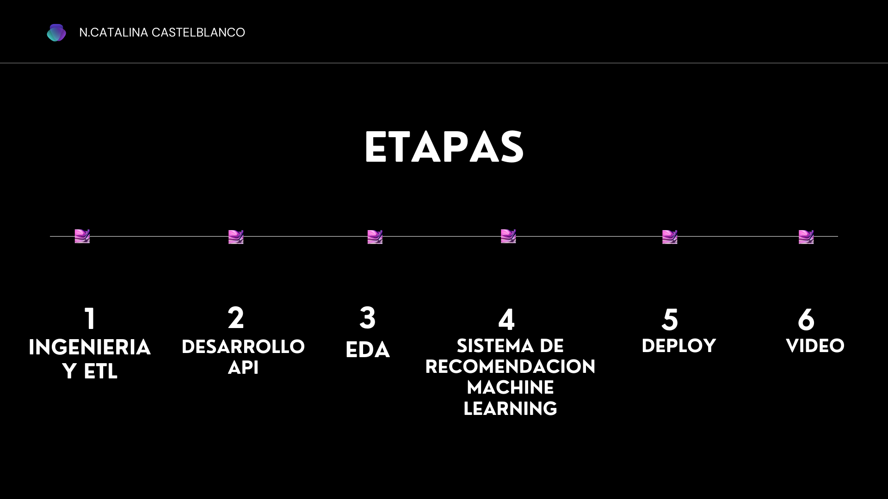

# 
<b><i>PROYECTO SISTEMA DE RECOMENDACION DE VIDEOJUEGOS</i></b>

### <h1 align=center>***Machine Learning Operations (MLOps)***</h1>

***<h1 align=center>Descripcion y objetivo</h1>***

En este proyecto nos posicionamos como Data Scientist en Steam, una plataforma multinacional de videojuegos y debemos encargarnos de crear un sistema de recomendacion de VideoJuegos para los usuarios.

para ello tenemos como objetivo desarrollar un modelo de Machine Learning atravesando tareas que involucra Data Engineering, esto es, realizar proceso de ETL, EDA y desarrollo de una API. Hasta la implementacion del modelo. 

***<h1 align=center>Estructura del repositorio</h1>***

El proyecto se encuentra organizado en cuatro cuadernos de Jupyter Notebook:

* *DesarrolloFuncApi:*
  - Incluye el desarrollo y algunos procesamientos adicionales al ETL, de los datos para el funcionamiento de la API.

* *DesarrolloML:* 
  - Incluye el desarrollo y preprocesamiento de los datos para el consumo del modelo de machine learning, así como la función usada en el archivo main.py.

* *EDA:* 
  - Incluye el análisis exploratorio y conclusiones de los datos e información relevante estudiada.

* *ETL:* 
  - Incluye la extracción, limpieza y procesamiento de los datos para luego usarlos en nuestras funciones y desarrollo de nuestro modelo.

Por otro lado incluimos un archivo ***main.py*** en el que exponemos nuestras funciones completas para consumo web

Y por ultimo una carpeta ***DataApi*** que incluye los archivos utilizados tanto para el consumo de la api como del modelo de machine learning

***<h1 align=center>Contexto</h1>***

Para el desarrollo del proyecto contamos con 3 datasets:

- user_reviews.json.gz: contiene los comentarios que los usuarios realizaron sobre los juegos que consumen proporcionando el ID y la url del usuario, sobre las reseñas muestra una serie de información adicional como fecha de publicación, si recomienda o no el juego, entre otras.

- users_items.json.gz: es un dataset que contiene información sobre los juegos que juegan los usuarios. Posee información detallada acerca de la interacción usuario-juego, como las horas jugadas. Además proporciona la cantidad de juegos que adquirió el usuario.

- steam_games.json.gz: es un dataset que contiene información detallada de todos los juegos en sí, como los título, el desarrollador, los precios, características técnicas, etiquetas, entre otros datos.

 

`1) Ingeneria de datos, ETL y API`

El proceso de **ETL** (Extracción, Transformación y Carga) Durante esta fase, se busca comprender exhaustivamente la información disponible, explorando las diversas estructuras y formatos de los datos, así como las relaciones entre los conjuntos de datos. El objetivo primordial radica en integrar los datos de manera eficiente y efectiva para su posterior utilización.

Se llevaron a cabo las siguientes acciones:

- **Extracción:** Se realizó la extracción, transformación y carga de los tres conjuntos de datos proporcionados, los cuales estaban comprimidos en archivos .gz. Sin embargo, dos de estos archivos presentaban errores de sintaxis, lo que añadió cierta complejidad al proceso. Se implementaron técnicas adicionales y se recurrió a librerías específicas para asegurar la correcta lectura de los archivos.

- **Transformación:** Se encontraron datos anidados, es decir, columnas que contenían diccionarios o listas de diccionarios. Ante esta situación, se aplicaron diversas estrategias para transformar las claves de dichos diccionarios en columnas accesibles y comprensibles. Se eliminaron aquellas columnas con una alta cantidad de valores nulos o que no contribuían significativamente al proyecto, todo ello con el objetivo de optimizar el rendimiento de la API, considerando las limitaciones de almacenamiento durante el despliegue.

- **Carga:** Para llevar a cabo estas transformaciones de manera eficiente y precisa, se hizo uso de la versátil librería Pandas.

`2) Desarrollo de la API con FastAPI`

Para el desarrollo de la API se optó por el framework **FastAPI**, creando las siguientes funciones:

* Función **PlayTimeGenre(genero: str)**

Esta función debe devolver el año con más horas jugadas para el género especificado. Tiene como parámetro de entrada un género dentro de los que se encuentran en nuestra base de datos.

* Función **UserForGenre(genero: str)**

Esta función debe devolver el usuario que acumula más horas jugadas para el género dado y una lista de la acumulación de horas jugadas por año. 

* Función **UsersRecommend(año: int)**

Esta función devuelve el top 3 de juegos MÁS recomendados por usuarios para el año dado. Tiene como parámetro el año de tipo entero.

* Función **UsersNotRecommend(año: int)**

Esta función devuelve el top 3 de juegos MENOS recomendados por usuarios para el año dado. El parámetro es un año ingresado de tipo entero.

* Función **sentiment_analysis(año: int)**

Esta función, según el año de lanzamiento, devuelve una lista con la cantidad de registros de reseñas de usuarios que se encuentren categorizados con un análisis de sentimiento, donde '0' indica un análisis negativo, '1' neutral y '2' positivo. Recibe como parámetro de entrada un año de tipo entero.

`3) Análisis Exploratorio de Datos (EDA)`

Durante la fase de **Análisis Exploratorio de Datos (EDA)**, se profundiza en la comprensión de la información disponible. Aunque la etapa de ETL se acompaña de un primer análisis exploratorio, previo al modelado de las variables para el sistema de recomendación, se llevó a cabo un EDA específicamente enfocado en este resultado.

* Objetivos :

1. Investigar las relaciones entre variables de los dataset.
2. Identificar patrones, tendencias y características significativas en los datos.
3. Evaluar la calidad y la consistencia de los datos.
4. Descubrir posibles problemas o limitaciones en el dataset.
5. Visualización de datos mediante gráficos y tablas.
6. Identificación de valores atípicos y valores faltantes.

`4)Sistema de Recomendación (Machine Learning)`

En esta fase, el desafío radicaba en desarrollar un sistema de recomendación utilizando técnicas de aprendizaje supervisado, accesible a través de la API. Se planteó el objetivo de desarrollar la siguiente función:

* Función **recomendacion_juego(id_de_producto)**

Al ingresar el ID del producto, se espera recibir una lista con 5 juegos recomendados similares al producto ingresado.

El modelo se basa en una relación ítem-ítem, lo que significa que, tomando un juego como referencia, se recomiendan otros juegos similares en base a su similitud.

Para medir la similitud entre los juegos (item_similarity), se utilizó la **similitud del coseno**. Esta medida es comúnmente utilizada en sistemas de recomendación y análisis de datos para evaluar la similitud entre dos vectores en un espacio multidimensional. En este caso, se aplicó esta técnica utilizando el dataframe de juegos y creando una nueva columna de recomendaciones mediante una función especialmente desarrollada. Esto se puede observar en el notebook [DesarrolloML](DesarrolloML.ipynb).
El uso de la similitud del coseno permite determinar cuán similares son dos juegos, facilitando así la generación de recomendaciones personalizadas y precisas para los usuarios.

`5) Deployment`

Para el despliegue de la API, se optó por la plataforma Render, una nube unificada para crear y ejecutar aplicaciones y sitios web. Render permite el despliegue automático desde GitHub, simplificando el proceso de implementación.

### Pasos para el Despliegue:

1. Seleccionar Render como plataforma de despliegue.
2. Generar un nuevo servicio en `render.com`.
3. Conectar el servicio al repositorio actual en GitHub.
4. Finalmente, el servicio queda corriendo en [pi1-mlops-henry-ncc.onrender.com](https://pi1-mlops-henry-ncc.onrender.com/docs).

El uso de Render facilita el despliegue y la gestión de la API, proporcionando una solución integral y confiable para la implementación de aplicaciones web.

`6) Video`

En este [video](https://www.youtube.com/watch?v=Y1lCcVUQL-E) se explica brevemente este proyecto mostrando el funcionamiento de la API.

***<h1 align=center>Autor</h1>***

***N.Catalina Castelblanco***

Pueden contactarme en [LinkedIn](https://www.linkedin.com/in/catalina-castelblanco/) para más detalles sobre el proyecto o para compartir sugerencias.

¡Gracias por visitar mi perfil!